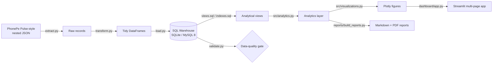

# Architecture

## System overview

## Layers

| Layer | Files | Responsibility |
|---|---|---|
| Dataset | `dataset/generate_pulse_data.py` | Reproducible Pulse-format JSON with real patterns |
| Extract | `etl/extract.py` | Walk folders, parse JSON, fail soft on missing/corrupt |
| Transform | `etl/transform.py` | Flatten nested JSON, build star schema, clean types |
| Load | `etl/load.py`, `src/database.py` | Write tables, apply indexes + views |
| Validate | `etl/validate.py` | 20 data-quality rules (non-empty, no nulls, referential, ranges) |
| Orchestrate | `etl/pipeline.py`, `main.py` | E-T-L-Validate with a CI-friendly exit code |
| Analytics | `src/queries.py`, `src/analytics.py` | Named SQL + derived metrics |
| Visualise | `src/visualizations.py` | Reusable Plotly builders + theme |
| Present | `dashboard/*` | Streamlit dashboard (10 pages) |
| Report | `reports/build_reports.py` | Auto-generated MD + PDF from the live DB |

## Design choices
- **Star schema** keeps facts narrow and dimensions conformed, so region/zone
  roll-ups never duplicate attributes on fact rows.
- **SQLAlchemy** abstracts the backend: SQLite for a zero-setup dev/test loop,
  MySQL 8 for production - identical code path.
- **Portable ANSI SQL** (window functions + CTEs) runs unchanged on both engines.
- **Validation as a gate** returns a non-zero exit code, making the pipeline
  safe to wire into CI / scheduled refresh.
- **Reports read the live DB**, so documentation figures can never drift.
