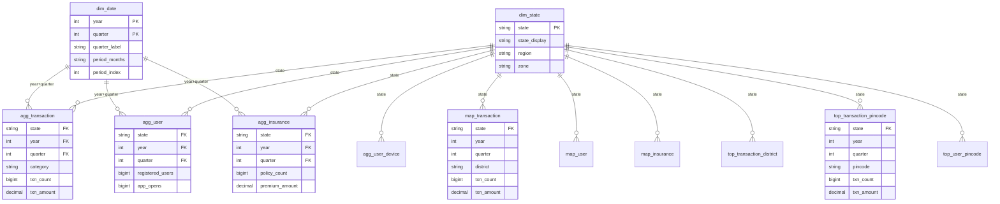

# Entity-Relationship Diagram

A star schema with conformed `dim_state` and `dim_date` dimensions.

```mermaid
erDiagram
    dim_state ||--o{ agg_transaction : "state"
    dim_state ||--o{ agg_user : "state"
    dim_state ||--o{ agg_user_device : "state"
    dim_state ||--o{ agg_insurance : "state"
    dim_state ||--o{ map_transaction : "state"
    dim_state ||--o{ map_user : "state"
    dim_state ||--o{ map_insurance : "state"
    dim_state ||--o{ top_transaction_district : "state"
    dim_state ||--o{ top_transaction_pincode : "state"
    dim_state ||--o{ top_user_pincode : "state"
    dim_date  ||--o{ agg_transaction : "year+quarter"
    dim_date  ||--o{ agg_user : "year+quarter"
    dim_date  ||--o{ agg_insurance : "year+quarter"

    dim_state {
        string state PK
        string state_display
        string region
        string zone
    }
    dim_date {
        int year PK
        int quarter PK
        string quarter_label
        string period_months
        int period_index
    }
    agg_transaction {
        string state FK
        int year FK
        int quarter FK
        string category
        bigint txn_count
        decimal txn_amount
    }
    agg_user {
        string state FK
        int year FK
        int quarter FK
        bigint registered_users
        bigint app_opens
    }
    agg_insurance {
        string state FK
        int year FK
        int quarter FK
        bigint policy_count
        decimal premium_amount
    }
    map_transaction {
        string state FK
        int year
        int quarter
        string district
        bigint txn_count
        decimal txn_amount
    }
    top_transaction_pincode {
        string state FK
        int year
        int quarter
        string pincode
        bigint txn_count
        decimal txn_amount
    }
```
